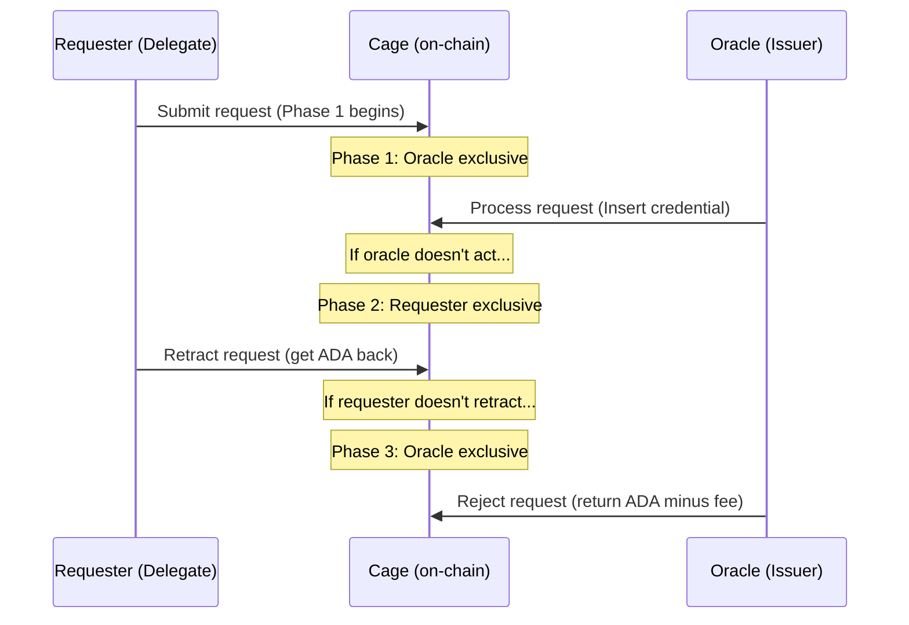
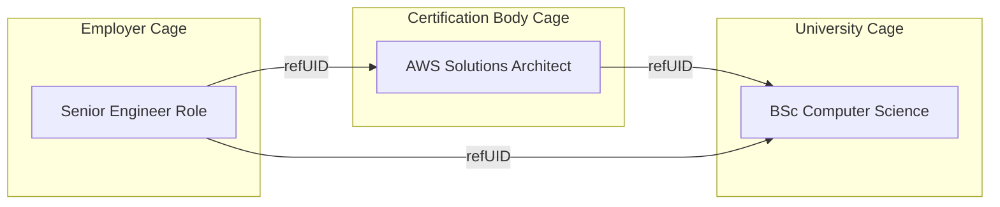

# Credential Issuers

Each credential issuer operates an independent MPFS cage. The cage token owner
is the issuer. The trie contains all active (non-revoked) credentials issued by
that entity.

## Credential data model

### Key

```
key = blake2b_256(schema_uid ++ recipient ++ nonce)
```

| Component | Purpose |
|-----------|---------|
| `schema_uid` | Identifies which schema this credential conforms to (authority cage token + schema key) |
| `recipient` | The public key hash of the credential subject |
| `nonce` | Ensures uniqueness (an issuer can issue multiple credentials of the same schema to the same recipient) |

### Value

```
{ schema     : (TokenId, ByteArray)  -- Schema authority cage token + schema key
, recipient  : PubKeyHash            -- Credential subject
, refUID     : Maybe ByteArray       -- Reference to another credential
, expiration : Maybe POSIXTime       -- When this credential expires (Nothing = never)
, data       : ByteArray             -- Encoded claims matching the schema
, time       : POSIXTime             -- Issuance timestamp
}
```

### Field descriptions

| Field | W3C Equivalent | Description |
|-------|---------------|-------------|
| `schema` | `credentialSchema` | Points to a schema in a schema authority's trie. The issuer's choice of schema authority is itself a trust signal. |
| `recipient` | `credentialSubject` | The entity the credential is about. May differ from the holder (e.g. a parent holds a child's credential). |
| `refUID` | (referenced credentials) | Optional reference to another credential, possibly in a different issuer's cage. Enables credential graphs (e.g. a professional certification that references an academic degree). |
| `expiration` | `validUntil` | Optional expiration timestamp. Off-chain verifiers check this; on-chain verifiers can check via validity ranges. |
| `data` | (claim data) | The actual credential claims, encoded according to the referenced schema. |
| `time` | `validFrom` | Issuance timestamp. |

## Operations

### Issue (Insert)

The issuer inserts a new entry into their credential trie. The MPFS cage
validator verifies the Merkle proof and updates the root.

### Revoke (Delete)

The issuer deletes an entry from their credential trie. After deletion:

- **Membership proofs** for that credential fail against the new root
- **Non-membership proofs** succeed, proving the credential was revoked
- The credential data is removed from the trie (true deletion, not flagging)

Revocation is only possible if the schema's `revocable` flag is `True`. The
off-chain TxBuilder enforces this.

### No Update

Credentials are immutable once issued. To change a credential, the issuer
revokes the old one and issues a new one. This preserves a clean audit trail
and avoids ambiguity about which version of a credential is current.

## Delegation via the 3-phase protocol

The MPFS cage's time-gated phases enable delegation:



A delegate (e.g. a department within a university) can submit credential
requests. The issuer (university) processes them. If the issuer fails to act
within the process window, the delegate can retract the request and recover
their locked ADA.

This is more robust than EAS delegation, which provides no timeout guarantees.

## Referenced credentials

The `refUID` field enables cross-cage credential graphs:



Verification of a referenced credential requires accessing the referenced
issuer's cage root — either via an additional reference input (on-chain) or an
additional Merkle proof in the proof bundle (off-chain).

## Expiration handling

Expired credentials remain in the trie until explicitly deleted by the issuer.
Verifiers must check the `expiration` field:

- **Off-chain**: compare `expiration` against current time
- **On-chain**: use the transaction validity range (`tx.validity_range`) to
  ensure the credential has not expired

The issuer may periodically clean up expired credentials via Delete operations
to keep the trie compact.
