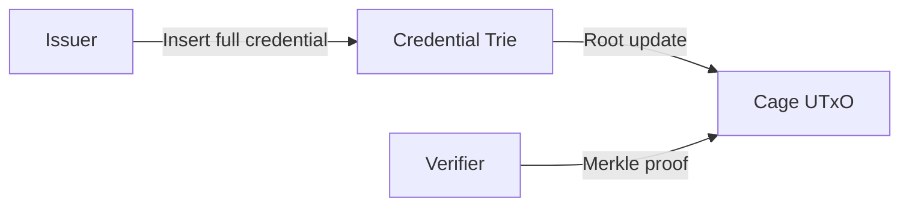
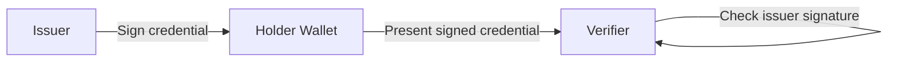

# On-chain and Off-chain Credentials

Cardano VCR supports three credential modes, each offering a different tradeoff
between privacy, verifiability, and on-chain cost.

## Mode 1: On-chain credentials

The credential is fully inserted into the issuer's trie. The root is updated
on-chain.



**Properties:**

- Full credential data derivable from chain history (via indexer)
- Immediately verifiable by any on-chain validator
- On-chain cost: one cage Modify transaction per credential (or per batch)
- Privacy: credential data is public (visible to indexers)

**Use cases:** Public credentials, professional certifications, regulatory
compliance records.

## Mode 2: Off-chain credentials

The issuer signs the credential off-chain. No on-chain transaction occurs. The
holder stores the signed credential in their wallet and presents it to verifiers
directly.



**Properties:**

- Zero on-chain cost
- Private — credential never appears on-chain
- Verifiable via issuer's signature (must know the issuer's public key)
- NOT verifiable by on-chain validators (no Merkle proof exists)
- No revocation support (issuer cannot retract what they never published)

**Use cases:** Ephemeral credentials, event tickets, informal attestations.

## Mode 3: Hybrid credentials (recommended)

The issuer inserts a **hash** of the credential into the trie. The full
credential data is stored off-chain (in the holder's wallet, IPFS, or any
storage system).

```mermaid
graph LR
    I[Issuer] -->|Insert blake2b(credential)| T[Credential Trie]
    T -->|Root update| U[Cage UTxO]
    I -->|Full credential data| H[Holder Wallet]
    H -->|Credential + Merkle proof| V[Verifier]
    V -->|Verify hash + proof| U
```

**Properties:**

- Credential existence provable on-chain (hash is in the trie)
- Full credential data private (only hash visible on-chain)
- Verifiable by on-chain validators (check hash + Merkle proof)
- Verifiable off-chain (same proof bundle mechanism)
- Revocable (issuer can delete the hash from the trie)
- On-chain cost: same as on-chain mode (one Modify per credential or batch)

**Use cases:** Medical records, KYC credentials, any credential where the data
is sensitive but existence and validity must be publicly verifiable.

### Verification flow (hybrid)

1. Holder presents: full credential data + Merkle proof
2. Verifier computes: `blake2b_256(credential_data)`
3. Verifier checks: Merkle proof confirms that hash exists in issuer's trie
4. Verifier checks: expiration, schema validity, trust policy

The verifier now knows:

- The credential was issued by a specific issuer (cage token identity)
- The credential has not been tampered with (hash matches)
- The credential has not been revoked (hash is in the trie)
- The credential data matches what the issuer committed to

## Comparison

| Property | On-chain | Off-chain | Hybrid |
|----------|----------|-----------|--------|
| On-chain cost | Per-credential tx | Zero | Per-credential tx |
| Data privacy | Public | Private | Private (hash only on-chain) |
| On-chain verification | Yes (Merkle proof) | No | Yes (hash + Merkle proof) |
| Off-chain verification | Yes (Merkle proof) | Yes (signature only) | Yes (Merkle proof) |
| Revocation | Yes (Delete) | No | Yes (Delete) |
| Non-membership proof | Yes | No | Yes |
| Data availability | Chain history | Holder only | Holder + optional backup |

## Batching

All three modes benefit from MPFS batching. Multiple credential operations
(inserts, deletes) can be folded into a single cage Modify transaction. The
proofs chain: each operation's output root becomes the next operation's input
root. This reduces on-chain cost per credential when issuing in bulk.
