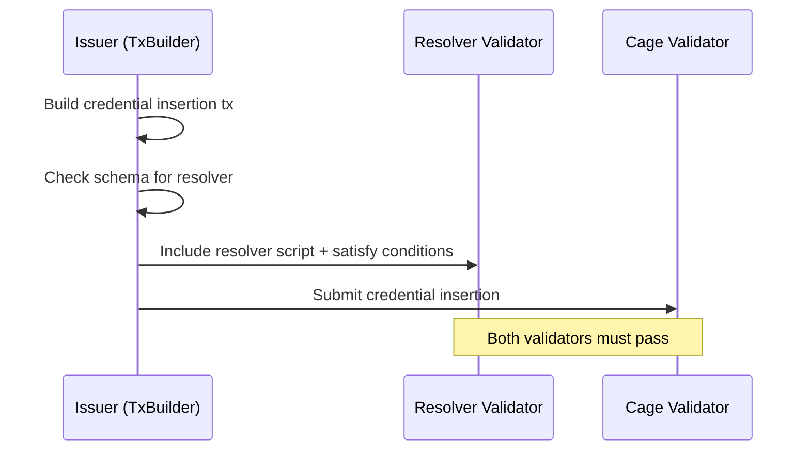

# Resolvers

Resolvers are optional Plutus validators that enforce custom logic when
credentials are issued under a specific schema. They are referenced in the
schema definition and must be satisfied during credential issuance transactions.

## How resolvers work

1. A schema authority registers a schema with a `resolver` field pointing to a
   Plutus script hash
2. When an issuer creates a credential under that schema, the off-chain
   TxBuilder detects the resolver reference
3. The transaction includes the resolver script (as a reference script or
   attached script) and satisfies its spending conditions
4. The cage validator processes the credential insertion as normal

## Use cases

### Payment resolver

Require a fee payment to a specific address when issuing credentials under a
schema. For example, a certification body charges for issuing professional
certifications.

### Access control resolver

Restrict which issuers can use a schema. The resolver checks that the
transaction is signed by an authorized issuer key. This enables a schema
authority to whitelist credential issuers for sensitive schemas (e.g. medical
credentials).

### Evidence resolver

Require that evidence of qualification is submitted alongside the credential.
The resolver checks that a specific datum (evidence hash) is included in the
transaction.

### Multi-signature resolver

Require multiple parties to co-sign a credential issuance. For example, a
credential requiring both the issuer and a regulator to approve.

## Comparison with EAS resolvers

EAS resolvers are Solidity smart contracts called as callbacks during
attestation creation. They execute in the same transaction via a cross-contract
call.

Cardano VCR resolvers are Plutus validators that must be satisfied in the same
transaction. The mechanism is different (UTxO spending vs contract callback) but
the capability is equivalent:

| Feature | EAS Resolver | Cardano VCR Resolver |
|---------|-------------|---------------------|
| Custom logic | Solidity contract callback | Plutus validator spending condition |
| Payment enforcement | Send ETH via `value` field | Spend UTxO at resolver address |
| Access control | Check `msg.sender` | Check transaction signatories |
| Composability | Single callback | Multiple validators in one tx |

## Optional by design

Resolvers are optional at the schema level. Most schemas will not have
resolvers. The resolver field exists for schemas that need additional
enforcement beyond the cage protocol's built-in guarantees.
