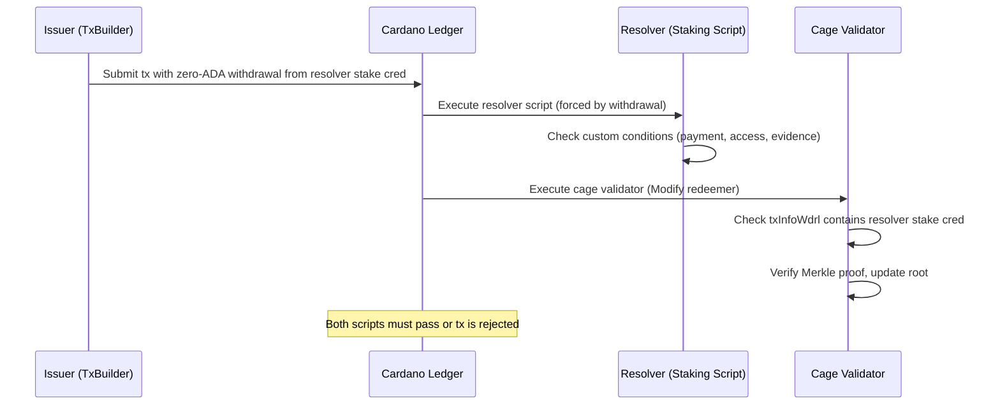

# Resolvers

Resolvers are optional Plutus validators that enforce custom logic when
credentials are issued under a specific schema. They are referenced in the
schema definition and must be satisfied during credential issuance transactions.

## The enforcement problem

In EAS on Ethereum, the attestation contract **calls** the resolver directly
via a cross-contract call. There is no ambiguity — the resolver executes or the
transaction reverts.

On Cardano's eUTxO model, validators are independent. The cage validator and
the resolver validator both run in the same transaction, but neither calls the
other. This raises a critical question: **how does the cage validator know the
resolver was actually satisfied, rather than simply trusting the off-chain
TxBuilder to include it?**

If the cage validator doesn't enforce resolver presence, a malicious issuer
could skip the resolver entirely and issue credentials under a resolver-gated
schema without satisfying the resolver's conditions.

## Enforcement mechanism: staking withdrawal witness

Cardano VCR uses the **staking withdrawal trick** — a well-known Cardano pattern
for forcing a script to execute as a transaction witness without managing a
persistent UTxO.

### How it works

1. The resolver is deployed as a **staking script** (registered as a stake
   credential)
2. The schema's `resolver` field contains the resolver's **stake credential
   hash**
3. When issuing a credential, the transaction includes a **zero-ADA withdrawal**
   from the resolver's stake credential
4. The cage validator checks that `txInfoWdrl` contains the resolver's stake
   credential — this is a **static check on transaction data**, fully
   enforceable on-chain
5. The presence of the withdrawal forces the resolver script to execute in the
   transaction — the Cardano ledger rules guarantee this



### Why this works

The Cardano ledger enforces a strict rule: **every withdrawal in a transaction
requires the corresponding staking credential's script to execute and succeed**.
This is not optional — it is a ledger-level guarantee. The cage validator only
needs to check that the withdrawal is present in `txInfoWdrl`; the ledger
handles the rest.

This gives the same atomicity as EAS's cross-contract call:

- If the resolver rejects → transaction fails → credential is not issued
- If the resolver is not included → cage validator sees missing withdrawal →
  transaction fails
- If both pass → credential is issued with resolver conditions satisfied

### Cage validator pseudo-code

```
-- During Modify (credential insertion):
case schema.resolver of
  Nothing  -> proceed normally
  Just resolverStakeCred ->
    -- Check that the resolver was executed in this transaction
    assert (resolverStakeCred `member` txInfoWdrl)
    -- The ledger guarantees the resolver script ran and succeeded
```

The check is a simple set membership test on the transaction's withdrawal map.
No cross-contract call, no UTxO management, no contention.

## Resolver script interface

A resolver staking script receives the standard Cardano staking redeemer
context. It has access to the full `ScriptContext`, including:

- `txInfoInputs` — all inputs being spent (including the cage UTxO)
- `txInfoOutputs` — all outputs being created
- `txInfoSignatories` — all public keys that signed the transaction
- `txInfoMint` — all tokens minted/burned
- `txInfoData` — all datums in the transaction

This gives resolvers full visibility into the credential issuance transaction,
enabling rich custom logic.

## Use cases

### Payment resolver

Require a fee payment to a specific address when issuing credentials under a
schema. The resolver checks that `txInfoOutputs` contains a payment to the
expected address with the expected amount. For example, a certification body
charges for issuing professional certifications.

### Access control resolver

Restrict which issuers can use a schema. The resolver checks that
`txInfoSignatories` contains an authorized issuer key. This enables a schema
authority to whitelist credential issuers for sensitive schemas (e.g. medical
credentials).

### Evidence resolver

Require that evidence of qualification is submitted alongside the credential.
The resolver checks that a specific datum (evidence hash) is present in
`txInfoData` or attached to an output.

### Multi-signature resolver

Require multiple parties to co-sign a credential issuance. The resolver checks
that `txInfoSignatories` contains all required public keys. For example, a
credential requiring both the issuer and a regulator to approve.

## Comparison with EAS resolvers

EAS resolvers are Solidity smart contracts called as callbacks during
attestation creation. They execute in the same transaction via a cross-contract
call.

Cardano VCR resolvers are Plutus staking scripts forced to execute via the
withdrawal trick. The mechanism is different but the guarantees are equivalent:

| Feature | EAS Resolver | Cardano VCR Resolver |
|---------|-------------|---------------------|
| Enforcement | Cross-contract call (EVM) | Withdrawal witness (ledger rule) |
| Atomicity | Same transaction | Same transaction |
| Custom logic | Solidity contract | Plutus staking script |
| Payment enforcement | Send ETH via `value` field | Check `txInfoOutputs` for payment |
| Access control | Check `msg.sender` | Check `txInfoSignatories` |
| Composability | Single callback | Multiple resolvers in one tx |
| UTxO management | N/A (account model) | None needed (staking trick) |
| Contention | N/A | None (no shared UTxO) |

### Advantage over EAS

Multiple resolvers can execute in the same transaction without contention. If a
credential references a schema with resolver A, and the transaction also issues
a credential under a schema with resolver B, both resolvers execute
independently. In EAS, nested resolver callbacks add gas cost and complexity.

## Alternative: UTxO-based resolvers

An alternative design uses a persistent UTxO at the resolver's script address.
The issuance transaction spends and re-creates this UTxO, forcing the resolver
to execute. The cage validator checks that `txInfoInputs` contains an input at
the resolver's address.

This works but has drawbacks:

- **Contention**: two issuers trying to use the same resolver simultaneously
  would conflict on the same UTxO
- **UTxO management**: someone must create and maintain the resolver UTxO
- **Complexity**: the resolver must handle its own UTxO continuity

The staking withdrawal approach avoids all of these issues and is the
recommended mechanism.

## Optional by design

Resolvers are optional at the schema level. Most schemas will not have
resolvers. The resolver field exists for schemas that need additional
enforcement beyond the cage protocol's built-in guarantees. When `resolver` is
`Nothing`, the cage validator skips the withdrawal check entirely.
