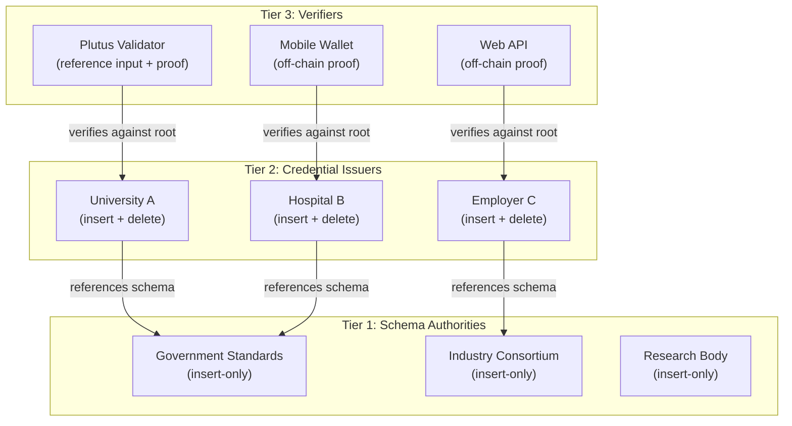
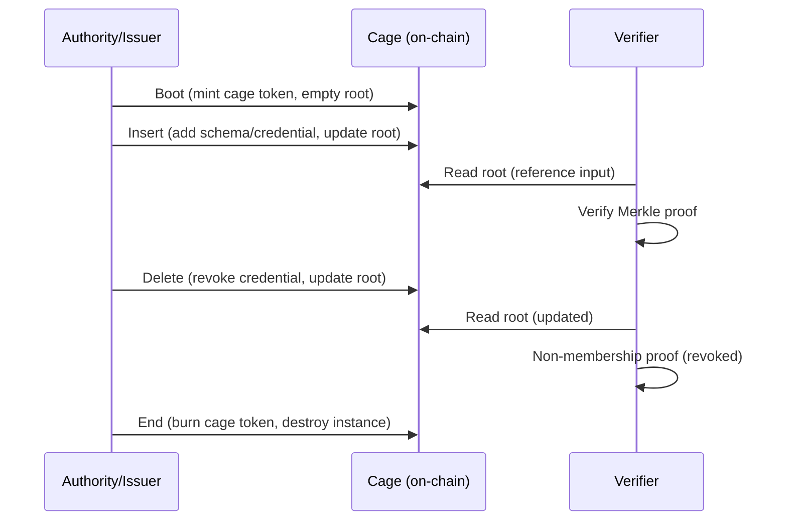

# Three-Tier Cage Architecture

Cardano VCR uses three tiers of MPFS cages, each serving a distinct role in the
credential lifecycle.

## Overview

## Tier 1: Schema authorities

Each schema authority operates an independent MPFS cage containing schema
definitions. Authorities set their own governance policies.

| Property | Value |
|----------|-------|
| **Cage owner** | The authority (standards body, consortium, individual) |
| **Trie key** | `blake2b(schema_definition)` — ensures uniqueness |
| **Trie value** | Schema definition, resolver reference, revocability flag, creator |
| **Allowed operations** | Insert (mostly). Delete and Update per authority policy |
| **Typical policy** | Append-only (no delete, no update) |

Multiple schema authorities coexist. They compete on trust and reputation. A
verifier chooses which authorities it recognizes. The protocol does not enforce
any hierarchy — trust is a policy decision.

See [Schema Authorities](schema-authorities.md) for details.

## Tier 2: Credential issuers

Each issuer operates an independent MPFS cage containing credentials. The cage
token owner is the issuer.

| Property | Value |
|----------|-------|
| **Cage owner** | The issuer (university, hospital, government, employer) |
| **Trie key** | `blake2b(schema_uid ++ recipient ++ nonce)` — unique credential ID |
| **Trie value** | Schema reference, recipient, expiration, claims data, timestamp, optional refUID |
| **Allowed operations** | Insert (issue credential), Delete (revoke credential) |
| **Typical policy** | Insert + Delete (revocation); no Update (credentials are immutable) |

See [Credential Issuers](credential-issuers.md) for details.

## Tier 3: Verifiers

Verifiers consume Merkle proofs. They do not operate cages — they read from
existing ones.

### On-chain verifiers (Plutus validators)

A Plutus validator verifies a credential by:

1. Reading the issuer's cage UTxO via **reference input** (provides the root)
2. Checking the **Merkle proof** in the transaction redeemer against that root
3. Optionally checking the schema (via a second reference input to a schema
   authority cage)

### Off-chain verifiers

Any entity capable of computing Blake2b-256 hashes can verify a credential:

1. Obtain a trusted root (via Mithril certificate or direct chain query)
2. Verify the Merkle proof against the root
3. Check expiration, schema validity, and any policy-specific rules

See [On-chain Verification](../verification/on-chain.md) and
[Off-chain Verification](../verification/off-chain.md).

## Independence and isolation

Each cage is fully independent:

- A compromised schema authority affects only credentials referencing its
  schemas. Other authorities and their schemas are untouched.
- A rogue issuer can only corrupt their own credential trie. Other issuers
  are unaffected.
- No single entity can take down the entire system. There is no global
  contract or shared state.

This isolation is a direct consequence of the per-entity cage model.

## Cage lifecycle

