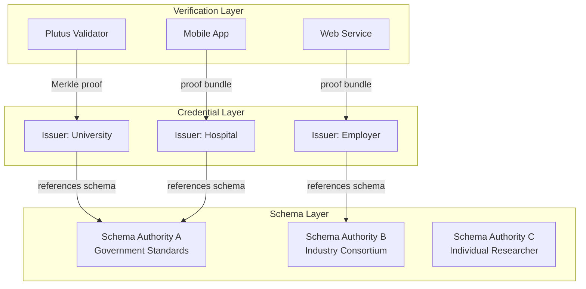

# Protocol Overview

Cardano VCR defines a protocol for verifiable credentials on Cardano. The protocol
maps the [W3C Verifiable Credentials Data Model 2.0][w3c-vc] onto MPFS cages,
using Merkle Patricia Tries for credential storage and proof generation.

## The problem

Digital credentials (diplomas, licenses, certifications, medical records, KYC
attestations) are currently managed by centralized systems. Holders do not own
their credentials. Issuers can silently revoke or alter them. Verifiers must
contact the issuer to check validity.

The [W3C Verifiable Credentials][w3c-vc] standard addresses this by defining a
three-party model ([issuer][w3c-issuer], [holder][w3c-holder],
[verifier][w3c-verifier]) with cryptographic proofs. Cardano VCR implements
this standard on Cardano.

## Design principles

### Authority-issued credentials

Credentials are meaningful because an authority stands behind them. A university
issues a degree. A government issues a passport. A hospital issues a medical
record. The W3C VC specification reflects this — [issuers][w3c-issuer] are
authoritative entities.

Cardano VCR embraces this model. Each issuer operates their own MPFS cage and
controls what credentials they issue and revoke. This is not a limitation — it
is the correct model for authoritative credentials.

### Verification over creation

The value of a credential lies in its **verifiability**, not in the ease of
creating it. Cardano VCR optimizes for the read/verify path:

- Any Plutus validator can verify a credential via a reference input and a
  Merkle proof in the redeemer
- Any off-chain entity can verify a credential using a proof bundle — no
  Cardano node required
- Proof of non-membership enables revocation verification and non-attestation
  proofs

### Decentralized trust

No single entity controls the protocol. Schema authorities, credential issuers,
and verifiers are all independent. Verifiers choose which authorities and issuers
they trust. The protocol provides the cryptographic machinery;
[trust is a social and policy decision][w3c-trust].

## Protocol layers

### Schema layer

Independent authorities manage schema registries. Each authority runs its own
MPFS cage with its own policy. Most authorities operate in **append-only mode**:
schemas, once registered, cannot be modified or deleted.

See [Schema Authorities](../architecture/schema-authorities.md).

### Credential layer

Issuers manage credential tries. Each issuer boots their own MPFS cage. The cage
token owner is the issuer. Credentials reference schemas from the schema layer.
Issuers can revoke credentials by deleting them from the trie.

See [Credential Issuers](../architecture/credential-issuers.md).

### Verification layer

Verifiers consume Merkle proofs. They can be Plutus validators (on-chain) or
any entity capable of hash computation (off-chain). Verification requires no
blockchain interaction — only the proof and a trusted root.

See [On-chain Verification](../verification/on-chain.md) and
[Off-chain Verification](../verification/off-chain.md).

[w3c-vc]: https://www.w3.org/TR/vc-data-model-2.0/
[w3c-issuer]: https://www.w3.org/TR/vc-data-model-2.0/#dfn-issuers
[w3c-holder]: https://www.w3.org/TR/vc-data-model-2.0/#dfn-holders
[w3c-verifier]: https://www.w3.org/TR/vc-data-model-2.0/#dfn-verifier
[w3c-trust]: https://www.w3.org/TR/vc-data-model-2.0/#trust-model
