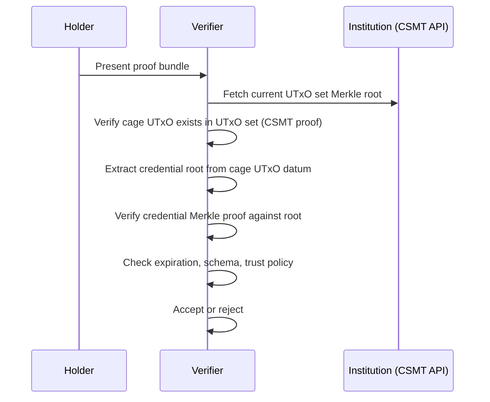

# Off-chain Verification

Off-chain verification allows any entity — a phone, a browser, an IoT device —
to verify a credential without running a Cardano node or submitting a
transaction. The verifier only needs the ability to compute Blake2b-256 hashes.

## Proof bundle

A holder presents a **proof bundle** to a verifier:

```
ProofBundle:
  credential:
    key   : ByteArray           -- Credential ID
    value : ByteArray           -- Credential data (or hash, for hybrid mode)
  issuer:
    cageToken : TokenId         -- Identifies the issuer
    root      : ByteArray       -- The issuer's current trie root (32 bytes)
  proof   : [ProofStep]         -- Merkle proof path
  schema  : Maybe SchemaProof   -- Optional schema verification
```

The verifier performs:

1. **Proof verification**: verify the Merkle proof for `(key, value)` against
   `root`. This is pure computation — hash the proof steps and check the result
   equals the root.

2. **Credential inspection**: decode the value, check expiration, schema
   reference, and any application-specific fields.

3. **Trust check**: does the verifier trust this `cageToken` as a credential
   issuer? This is a policy decision.

4. **Root trust**: does the verifier trust that `root` is the authentic current
   root for this cage? This is the critical question — see
   [Trust Chain](trust-chain.md).

## Root distribution

The proof bundle includes a root, but the verifier must trust that root.
Several trust levels are possible, from strongest to weakest:

### Level 1: Direct chain query

The verifier queries a Cardano node (via N2C or an API) for the cage UTxO and
reads the root from its datum. This is authoritative but requires network access
and a trusted node.

### Level 2: Institutionally certified CSMT root

The verifier obtains the current UTxO set Merkle root from a trusted institution
(e.g. the Cardano Foundation) running [cardano-utxo-csmt][csmt]. It then
verifies the cage UTxO's existence in the certified set via a CSMT inclusion
proof and reads the credential root from the datum.

No full node required — only an HTTP request for the CSMT root plus local hash
verification.

See [Trust Chain](trust-chain.md) for the full verification path.

### Level 3: Issuer-signed root

The issuer periodically signs their current root and publishes it (on a website,
via an API, etc.). The verifier trusts the issuer's signature. This is the
simplest approach but relies on the issuer's key management.

### Level 4: Holder-provided root (weakest)

The verifier trusts the root provided in the proof bundle. This is only
appropriate when the verifier has other means of establishing trust (e.g. the
holder is presenting in person with government-issued ID).

## Verification without a node

The complete off-chain verification flow, assuming Level 2 (institutional CSMT):



The only network interaction is fetching the CSMT root. All proof verification
is local computation.

## Offline verification

If the verifier has a cached CSMT root, verification is fully offline. The
tradeoff is freshness — the cached root may be stale. A credential revoked
after the root was fetched will still appear valid.

For time-sensitive credentials, the verifier can set a maximum age for the
cached root (e.g. "I only accept roots less than 5 minutes old"). The
cardano-utxo-csmt service updates with every block (~20 seconds), so near
real-time freshness is achievable.

## Multiple credentials

Off-chain verifiable presentations bundle multiple proof bundles:

```
Presentation:
  credentials:
    - { issuer: A, key: ..., value: ..., proof: [...] }
    - { issuer: B, key: ..., value: ..., proof: [...] }
  roots:
    - { cageToken: A, root: ..., csmtProof: [...] }
    - { cageToken: B, root: ..., csmtProof: [...] }
  csmtRoot: ByteArray  -- Single UTxO set root from institution
```

One CSMT root anchors multiple cage UTxO proofs, which anchor multiple
credential proofs. The entire bundle is self-contained and independently
verifiable (given the trusted CSMT root).

[csmt]: https://github.com/cardano-foundation/cardano-utxo-csmt
