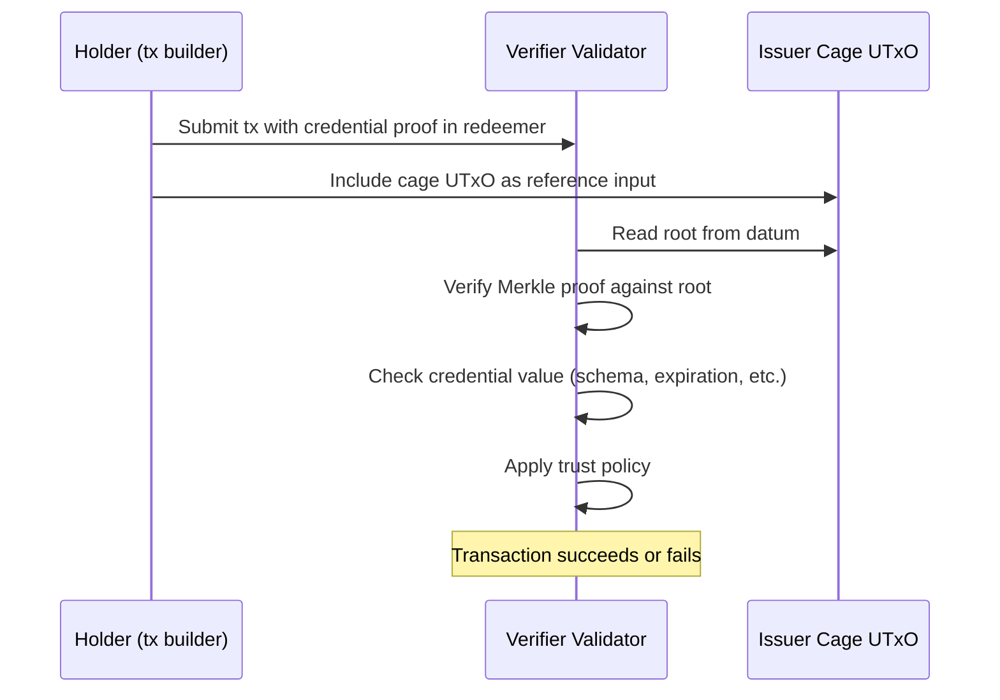

# On-chain Verification

On-chain verification allows any Plutus validator to check a credential's
validity within a Cardano transaction. This enables credential-gated smart
contracts — contracts that only execute if a valid credential is presented.

## Mechanism

A Plutus validator verifies a credential by consuming:

1. **Reference input**: the issuer's cage UTxO (provides the credential trie
   root in its datum)
2. **Redeemer data**: a Merkle proof demonstrating that the credential key
   exists in the trie with the expected value



## Transaction structure

```
Transaction:
  Reference inputs:
    - Issuer cage UTxO (token: <cage_token_id>, datum: { root, owner, ... })
    - (Optional) Schema authority cage UTxO

  Redeemer:
    { credentialProof  : [ProofStep]      -- Merkle proof for credential
    , credentialKey    : ByteArray         -- Credential ID
    , credentialValue  : ByteArray         -- Expected credential data
    , schemaProof      : Maybe [ProofStep] -- Merkle proof for schema (optional)
    }

  Validator logic:
    1. Extract root from issuer cage datum
    2. Verify credentialProof against root for (credentialKey, credentialValue)
    3. Decode credentialValue, check expiration against tx validity range
    4. (Optional) Verify schema exists in schema authority cage
    5. Apply application-specific logic
```

## Verifiable presentations

A single transaction can verify credentials from multiple issuers — this is a
verifiable presentation in W3C terms:

```
Transaction:
  Reference inputs:
    - University cage UTxO (issuer A)
    - Certification body cage UTxO (issuer B)
    - Government schema authority cage UTxO

  Redeemer:
    { credentials:
        [ { issuerCage: <university_token>, proof: [...], key: ..., value: ... }
        , { issuerCage: <cert_body_token>, proof: [...], key: ..., value: ... }
        ]
    , schemaProofs:
        [ { authorityCage: <gov_token>, proof: [...], key: ... }
        ]
    }
```

The validator iterates over the credential list, verifying each proof against
the corresponding issuer's root.

## Non-membership proofs (revocation check)

To prove a credential has been revoked, the verifier checks non-membership:

1. The holder provides a **non-membership proof** for the credential key
2. The validator verifies against the issuer's current root
3. If the proof succeeds, the credential does not exist in the trie — it has
   been revoked (or was never issued)

This enables smart contracts that gate on the **absence** of a credential. For
example: "this action is only allowed if the subject has NOT been blacklisted."

## Cost

On-chain verification cost is dominated by Merkle proof verification:

- Each proof step: one Blake2b-256 hash computation + comparison
- Proof length: O(log n) where n is the number of credentials in the issuer's
  trie
- For a trie with 1 million credentials: ~20 hash steps
- Reference inputs are free (no UTxO consumption)

This is significantly cheaper than cross-contract calls on Ethereum, where
verifying an EAS attestation requires SLOAD operations on the EAS contract's
storage.
